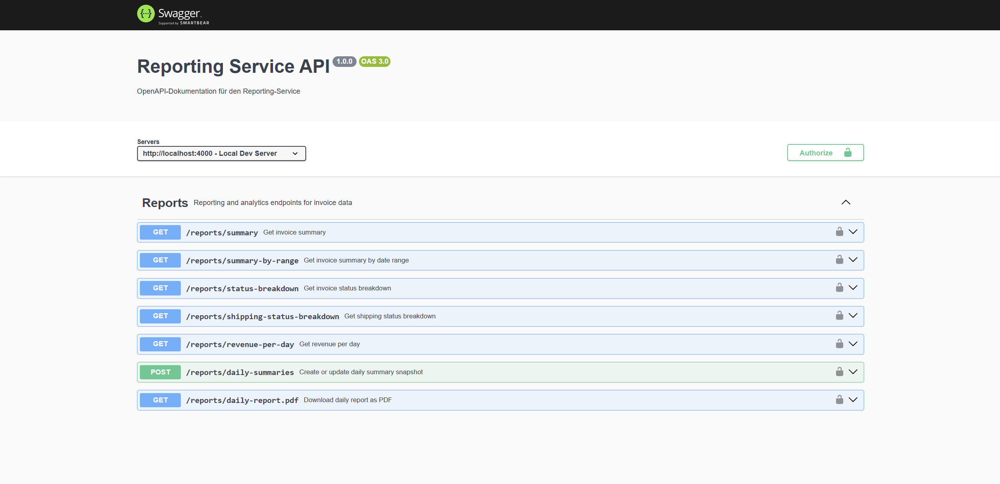

# Reporting Service API


A backend microservice for invoice reporting, revenue analytics, PDF report generation and operational monitoring.

The service is designed as a reporting component that could be part of a larger invoice, ERP or back-office system.

---

## Project Goal

The goal of this project is to build a realistic backend reporting service instead of a simple demo API.

The service reads invoice data from MongoDB, calculates reporting metrics, exposes protected report endpoints, generates PDF reports and provides operational endpoints for monitoring and production readiness.

The project focuses on backend topics that are relevant in real business systems:

* reporting and analytics logic
* MongoDB aggregation
* protected API access
* role-based report access
* optional caching
* PDF generation
* operational health and readiness checks
* Docker-based local infrastructure
* automated testing and CI validation

---

## Tech Stack

* Node.js
* Express.js
* MongoDB
* Mongoose
* Redis
* JWT
* PDFKit
* Swagger / OpenAPI
* Docker
* Docker Compose
* Jest
* Supertest
* GitHub Actions
* node-cron
* dotenv
* Render
* MongoDB Atlas

---

## Features

Current features:

* Express backend API
* MongoDB connection using environment variables
* Startup configuration validation
* Invoice summary reporting
* Revenue grouped by day
* Daily PDF report generation
* API-Key protection for private endpoints
* JWT authentication for reporting routes
* Role-based access control for reports
* Optional Redis response caching
* Swagger / OpenAPI documentation
* Health endpoint
* Readiness endpoint with dependency status
* Runtime metrics endpoint
* Graceful shutdown handling
* Dockerfile for API container
* Docker Compose setup with MongoDB and Redis
* Automated tests with Jest and Supertest
* GitHub Actions CI workflow
* Docker image build validation in CI
* Live deployment on Render
* MongoDB Atlas production database connection


Planned improvements:

* Further production hardening
* Structured logging improvements


---

## API Endpoints

### Reporting

| Method | Endpoint                                                  | Description                               | Protection           |
| ------ | --------------------------------------------------------- | ----------------------------------------- | -------------------- |
| GET    | `/reports/summary`                                        | Invoice summary statistics                | API-Key + JWT + role |
| GET    | `/reports/summary-by-range?from=YYYY-MM-DD&to=YYYY-MM-DD` | Invoice summary for a specific date range | API-Key + JWT + role |
| GET    | `/reports/revenue-per-day`                                | Revenue grouped by day                    | API-Key + JWT + role |
| GET    | `/reports/daily-report.pdf`                               | Generate PDF report                       | API-Key + JWT + role |

Reporting endpoints are limited to users with one of the following roles:

```text
report_reader
admin
```

### Monitoring and Operations

| Method | Endpoint                 | Description                  | Protection |
| ------ | ------------------------ | ---------------------------- | ---------- |
| GET    | `/`                      | Basic service response       | Public     |
| GET    | `/health`                | Service liveness check       | Public     |
| GET    | `/ready`                 | Dependency readiness check   | Public     |
| GET    | `/metrics`               | Runtime metrics              | Public     |
| GET    | `/monitoring/email-test` | Optional Mailtrap test email | API-Key    |

---

## Example Responses

### Invoice summary

```json
{
  "totalInvoices": 12,
  "totalRevenue": 2450,
  "openInvoices": 4,
  "paidInvoices": 7,
  "cancelledInvoices": 1
}
```

### Invoice summary by date range

```json
{
  "from": "2026-06-01",
  "to": "2026-06-30",
  "totalInvoices": 8,
  "totalRevenue": 1800,
  "openInvoices": 3,
  "paidInvoices": 4,
  "cancelledInvoices": 1
}
```

### Revenue per day

```json
[
  {
    "date": "2026-06-09",
    "totalRevenue": 350,
    "invoiceCount": 2
  },
  {
    "date": "2026-06-10",
    "totalRevenue": 1200,
    "invoiceCount": 5
  }
]
```

### Readiness response

```json
{
  "status": "ready",
  "service": "reporting-service-api",
  "dependencies": {
    "mongodb": "connected",
    "redis": "not_configured"
  },
  "time": "2026-06-13T10:00:00.000Z"
}
```

### Metrics response

```json
{
  "service": "reporting-service-api",
  "uptimeSeconds": 120,
  "rss": 81264640,
  "heapTotal": 28966912,
  "heapUsed": 18432000,
  "external": 2048000,
  "nodeEnv": "development"
}
```

---

## Authentication and Authorization

Protected reporting endpoints require two layers of access control.

### API Key

Private endpoints require an API key in the request header:

```http
x-api-key: your_api_key_here
```

### JWT Bearer Token

Reporting routes also require a valid JWT:

```http
Authorization: Bearer <jwt-token>
```

The service validates JWT tokens and checks the user role before allowing access to reporting endpoints.

Token issuing is intentionally outside the scope of this service. In a larger system, this reporting service would typically validate tokens issued by an authentication service.

---

## Project Structure

```text
reporting-service-api/
|
|-- .github/
|   `-- workflows/
|       `-- ci.yml
|
|-- config/
|   `-- env.js
|
|-- controllers/
|-- middleware/
|-- models/
|-- routes/
|-- services/
|-- swagger/
|-- tests/
|-- utils/
|
|-- docs/
|   `-- swagger-ui.png
|
|-- index.js
|-- Dockerfile
|-- docker-compose.yml
|-- .dockerignore
|-- .env.example
|-- package.json
|-- package-lock.json
`-- README.md
```

---

## Architecture Overview

The project follows a compact backend service structure.

```text
Client
  |
  v
Express API
  |
  v
API-Key Middleware
  |
  v
JWT Authentication
  |
  v
Role Authorization
  |
  v
Report Routes
  |
  v
Report Controller
  |
  +--> Optional Redis Cache
  |
  +--> MongoDB Aggregation
  |
  +--> PDF Generation
```

Monitoring endpoints such as `/health`, `/ready` and `/metrics` are separated from protected reporting routes so that local tools, containers or deployment environments can check the service state.

MongoDB is the required data source for reports. Redis is used only as an optional cache layer.

---

## Environment Variables

Create a local `.env` file based on `.env.example`.

```env
PORT=4000
MONGODB_URI=mongodb://127.0.0.1:27017/reporting_service
API_KEY=your_api_key_here
JWT_SECRET=your_jwt_secret_here

# Optional
REDIS_URL=
```

Required variables:

| Variable      | Description                      |
| ------------- | -------------------------------- |
| `MONGODB_URI` | MongoDB connection string        |
| `API_KEY`     | API key for protected API access |
| `JWT_SECRET`  | Secret used to verify JWT tokens |

Optional variables:

| Variable    | Description                             |
| ----------- | --------------------------------------- |
| `PORT`      | API port, defaults to `4000`            |
| `REDIS_URL` | Redis connection URL for optional cache |

If Redis is not installed locally, leave `REDIS_URL` empty.

The service validates required environment variables during startup and stops with a clear error message if a required value is missing.

The `.env` file is ignored by Git and should not be committed.

---

## Getting Started

Install dependencies:

```bash
npm install
```

Start the application:

```bash
npm start
```

The API will be available at:

```text
http://localhost:4000
```

Swagger UI will be available at:

```text
http://localhost:4000/api-docs
```

---

## Run with Docker

Build the Docker image:

```bash
docker build -t reporting-service-api .
```

Run the container manually:

```bash
docker run -p 4000:4000 reporting-service-api
```

For manual container runs, MongoDB and optional Redis must already be available and configured through environment variables.

### Docker Compose

Docker Compose starts the API together with MongoDB and Redis:

```bash
docker compose up --build
```

The local Compose setup includes:

* API service on port `4000`
* MongoDB on port `27017`
* Redis on port `6379`
* MongoDB volume for persistent local data
* Health checks for MongoDB and Redis before starting the API

Stop the local stack:

```bash
docker compose down
```

Stop the stack and remove the MongoDB volume:

```bash
docker compose down -v
```

---

## Run Tests

Run the automated test suite:

```bash
npm test
```

The tests cover:

* API-Key middleware behavior
* JWT authentication checks
* Role-based access checks
* Invoice summary aggregation
* Revenue grouped by day
* PDF report generation
* Monitoring endpoints
* Readiness endpoint behavior

---

## Continuous Integration

This project uses GitHub Actions as a basic CI quality gate.

The CI workflow runs automatically on pushes and pull requests to the `main` branch.

The workflow performs the following checks:

* installs dependencies with `npm ci`
* starts a MongoDB service for integration tests
* runs the automated Jest test suite
* validates that the Docker image can be built successfully

Redis is not required during CI test execution because caching is disabled in the test environment.

Workflow file:

```text
.github/workflows/ci.yml
```

---

## Monitoring and Production Readiness

### Health check

```text
http://localhost:4000/health
```

`/health` checks whether the API process is running.

### Readiness check

```text
http://localhost:4000/ready
```

`/ready` checks whether the service is ready to handle requests by reporting the status of required and optional dependencies.

MongoDB is treated as a required dependency. If MongoDB is not connected, the readiness endpoint returns `503`.

Redis is optional. If Redis is not configured or temporarily unavailable, the service can still serve reports by reading from MongoDB.

### Runtime metrics

```text
http://localhost:4000/metrics
```

`/metrics` exposes basic runtime information such as uptime and memory usage.

### Graceful shutdown

The service handles shutdown signals such as `SIGINT` and `SIGTERM`.

On shutdown, the HTTP server stops accepting new requests and open MongoDB and cache connections are closed before the process exits.

---

## Swagger Documentation

Swagger UI is available after starting the application:

```text
http://localhost:4000/api-docs
```

The documentation includes:

* available reporting endpoints
* request descriptions
* response information
* API-Key authentication
* JWT Bearer authentication

### Swagger UI Preview



---


## Live Deployment

The API is deployed on Render and connected to MongoDB Atlas.

```text
https://reporting-service-api.onrender.com
```

Swagger UI is available at:
```text
https://reporting-service-api.onrender.com/api-docs
```

Note: The service runs on Render's free plan, so the first request after inactivity may take a few seconds.

---

## Business Rules

Current reporting rules:

* Reporting endpoints require a valid API key.
* Reporting endpoints require a valid JWT.
* Only `report_reader` and `admin` roles can access report data.
* Invoice summary values are calculated from invoice data stored in MongoDB.
* Revenue-per-day reports group invoice revenue by invoice creation date.
* PDF reports are generated from current reporting data.
* Report responses may be cached when Redis is configured.
* Redis is optional and must not make the service unavailable when it is not configured.
* MongoDB is required because it is the main reporting data source.
* Missing required environment variables stop the service during startup.
* Readiness depends on MongoDB, not on Redis.
* Health checks and readiness checks are public operational endpoints.
* Date range summaries only include invoices created within the requested date range.
* Date range requests require `from` and `to` query parameters in `YYYY-MM-DD` format.

---

## Reporting Design Principles

The project separates operational concerns from reporting concerns.

Reporting endpoints focus on business data such as invoice totals, revenue grouped by day and PDF report generation.

Operational endpoints focus on runtime behavior such as process health, dependency readiness and metrics.

The service treats MongoDB as the source of truth for reporting data. Redis is used only as an optional cache to reduce repeated aggregation work.

This keeps the service understandable while still showing how a backend reporting component can be prepared for production-like environments.

---

## Current Status

Implemented:

* Reporting API endpoints
* Date range summary reporting
* MongoDB aggregation for invoice analytics
* PDF report generation
* API-Key protection
* JWT authentication
* Role-based authorization
* Optional Redis cache
* Swagger / OpenAPI documentation
* Health endpoint
* Readiness endpoint
* Runtime metrics endpoint
* Graceful shutdown handling
* Startup configuration validation
* Dockerfile
* Docker Compose setup with MongoDB and Redis
* Automated API tests
* GitHub Actions CI workflow
* Docker build validation in CI
* Live deployment on Render
* MongoDB Atlas production database connection

Current focus:

* Portfolio presentation and final review

Planned improvements:

* Structured logging improvements
* Centralized error handling
* Further production hardening


---

## Roadmap

Completed:

1. Basic Express API setup
2. MongoDB integration
3. Invoice summary reporting
4. Revenue-per-day reporting
5. Date range summary reporting
6. PDF report generation
7. API-Key protection
8. JWT authentication
9. Role-based report access
10. Optional Redis caching
11. Swagger / OpenAPI documentation
12. Automated API tests
13. Docker support
14. Docker Compose setup
15. GitHub Actions CI workflow
16. Readiness endpoint
17. Graceful shutdown handling
18. Startup configuration validation
19. Render deployment
20. MongoDB Atlas production database connection

Next possible milestones:

21. Structured logging improvements
22. Centralized error handling
23. Further production hardening


---

## Why this project matters

Reporting services are common in real business systems.

Companies often need backend services that can read invoice or order data, calculate revenue metrics, generate reports and expose operational status for deployment environments.

This project demonstrates backend skills that are relevant for roles such as:

* Backend Developer
* API Developer
* Integration Developer
* Software Developer

The project is focused on backend service design, reporting logic and production-oriented operational behavior instead of frontend design.

---

## Design Philosophy

This project follows a service-oriented backend approach.

The reporting service does not try to model a complete ERP system. Instead, it focuses on one realistic responsibility: reading invoice data and providing reporting output through a protected backend API.

The design keeps the service small enough to understand, but complete enough to demonstrate practical backend concerns such as authentication, authorization, aggregation, caching, monitoring, Docker, CI and startup validation.

---

## Author

Moj Tabari

* Website: https://mtintelligence.ai
* LinkedIn: https://www.linkedin.com/in/moj-tabari-04a400227/

---

## License

This project is developed as a production-oriented backend API project for portfolio and professional demonstration purposes.
